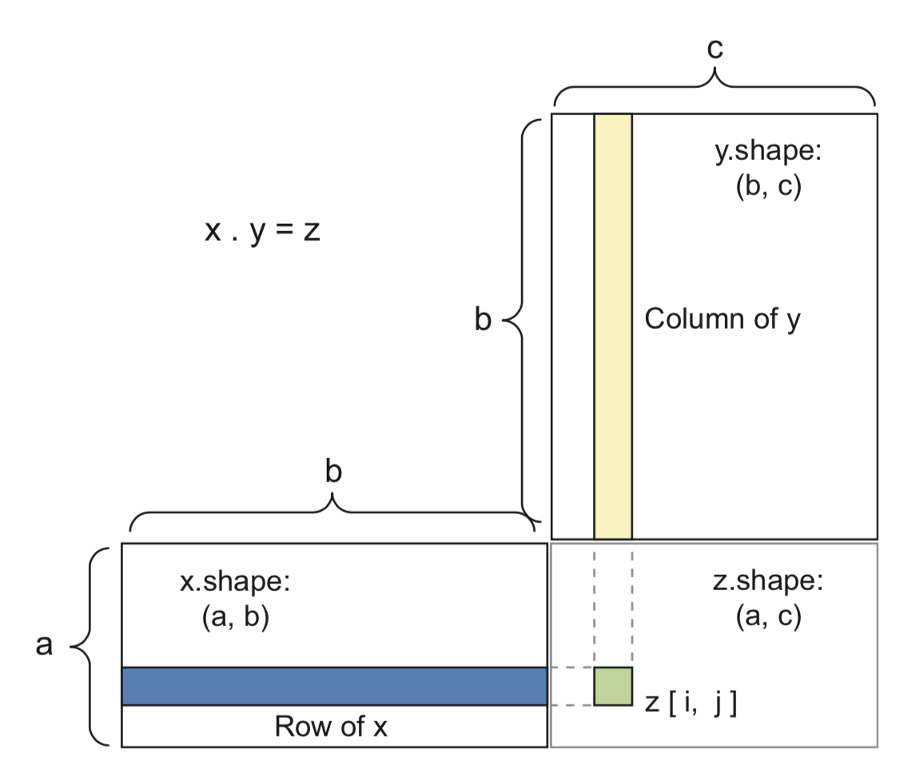
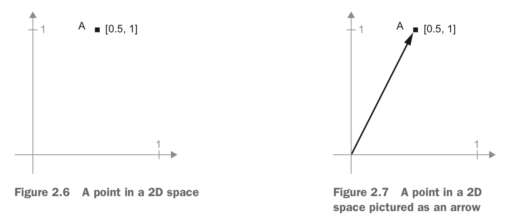
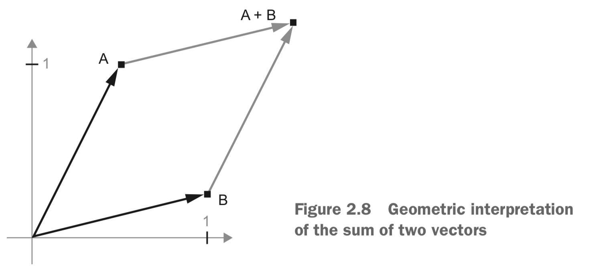
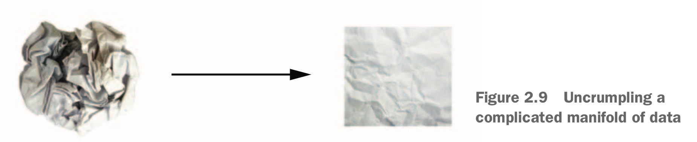
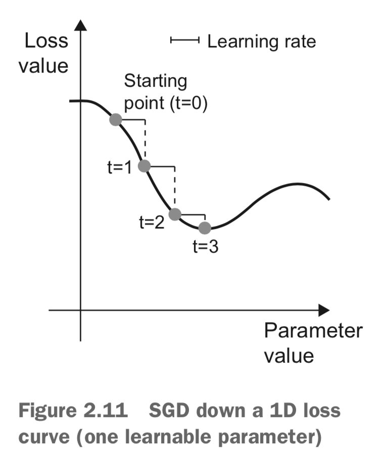
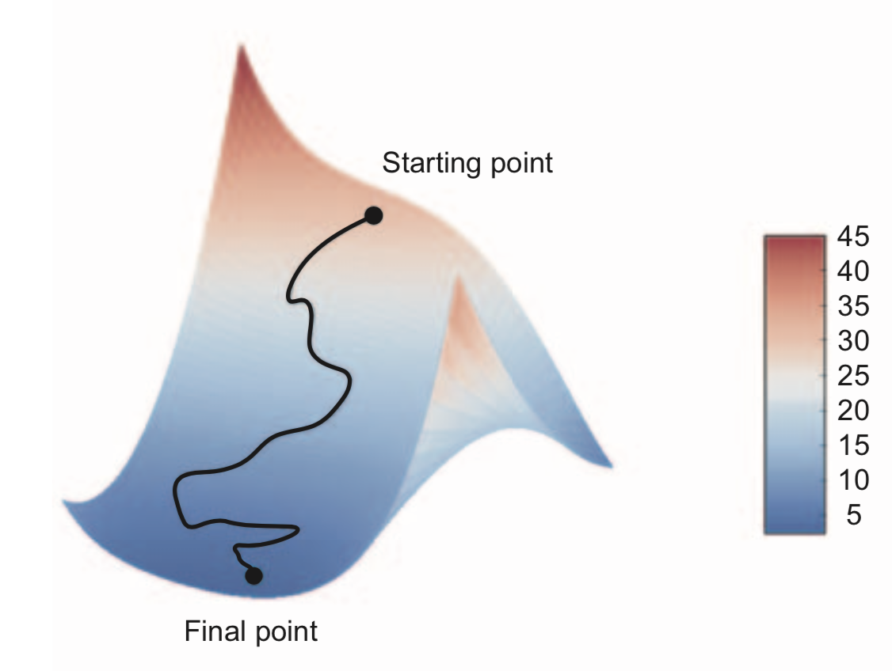
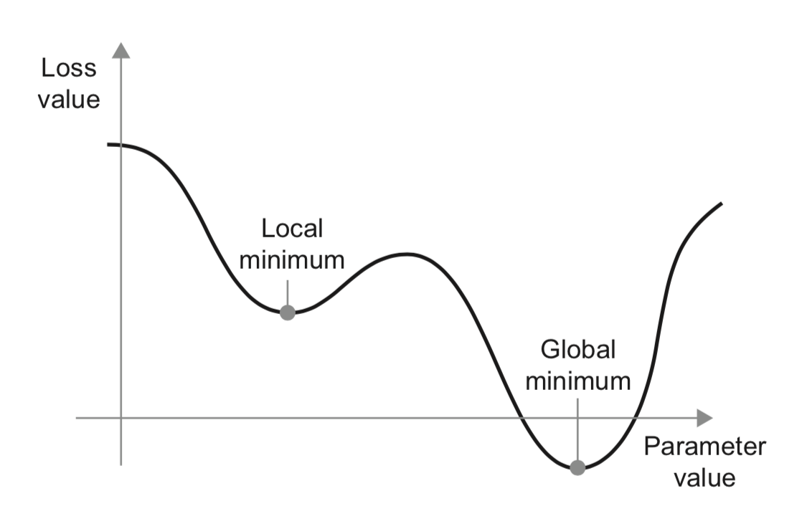

layout: true

```{r setup, include=FALSE}
options(htmltools.dir.version = FALSE)
knitr::opts_chunk$set(
  eval = FALSE,
  message = FALSE,
  echo = TRUE,
  warnings = FALSE,
  fig.align = "center"
)
```


---

```{r, include=FALSE, eval=TRUE}
library(keras)
```


[from here: YOU]

# Chapter 2 Agenda

**Before we begin: the mathematical building blocks of neural networks**

- content1
- content2
- content3

A first example of a neural network

Tensors and tensor operations

How neural networks learn via backpropagation and gradient descent

---


# A first look at a neural network


---


# Data representations for neural networks


---

# The gears of neural networks: tensor operations


---

# Tensor operations: tensor dot

Tensor dot (tensor product) - combines entries in the input tensors, NOT element wise!

Notation: `x %*% y` - on paper you'll see $x \cdot y$

--

With x and y as vectors...

```{r}
naive_vector_dot <- function(x, y) {
  z <- 0
  for (i in 1:length(x))
    z <- z + x[[i]] * y[[i]]
  z
}
```

--

With a matrix and a vector:

```{r}
naive_matrix_vector_dot <- function(x, y) {
  z <- rep(0, nrow(x))
  for (i in 1:nrow(x))
    for (j in 1:ncol(x))
      z[[i]] <- z[[i]] + x[[i, j]] * y[[j]]
  z 
}
```

```{r}
naive_matrix_vector_dot <- function(x, y) {
  z <- rep(0, nrow(x))
  for (i in 1:nrow(x))
    z[[i]] <- naive_vector_dot(x[i,], y)
  z
}
```

---

# Tensor operations: tensor dot

`x %*% y` is not simmetric!

Generalizing...  
E.g.: two matrices

Works if `ncol(x) == nrow(y)`

--

<p align="center">

</p>

---

# Tensor operations: tensor dot

```{r}
naive_matrix_dot <- function(x, y) {
  z <- matrix(0, nrow = nrow(x), ncol = ncol(y))
  for (i in 1:nrow(x))
    for (j in 1:ncol(y)) {
      row_x <- x[i,]
      column_y <- y[,j]
      z[i, j] <- naive_vector_dot(row_x, column_y)
    } 
  z
}
```

---

# Tensor operations: tensor reshaping

Used especially during preprocessing  
Definition: rearranging its rows and columns to match a target shape  
Nr of coefficients: unchanged

```{r}
train_images <- array_reshape(train_images, c(60000, 28 * 28))
```

--

`array_reshape()` vs `dim<-()`  
Reinterpreted using row-major semantics vs column-major

--

```{r}
x <- matrix(c(0, 1,
              2, 3,
              4, 5),
            nrow = 3, ncol = 2, byrow = TRUE)
x
x1 <- array_reshape(x, dim = c(6, 1))
x2 <- array_reshape(x1, dim = c(2, 3))
## vs
x3 <- x1
dim(x3) <- c(2, 3)
```

---

# Tensor operations: tensor reshaping

A special case of reshaping: *transposition* -> exchanging its rows and its columns

```{r}
x <- matrix(0, nrow = 300, ncol = 20)
dim(x)
x <- t(x)
dim(x)
```

---
        
# Tensor operations: A geometric interpretation 

All tensor operations have a geometric interpretation.  
Addition. 

`A = [0.5, 1.0], B = [1, 0.25]`

--



---
        
# Tensor operations: A geometric interpretation 

<p align="center">

</p>

--

**Addition**: chaining together the vector arrows, with the resulting location being the vector representing the sum of the two vectors

--

Elementary geometric operations (affine transformations, rotations, scaling) can also be expressed as tensor operations. 

```{r}
R <- matrix(c("cos(theta)", "-sin(theta)",
            "cos(theta)", "-sin(theta)"),
            nrow = 2, byrow = TRUE)
R
```

---

# Deep learning: a geometric interpration

Neural networks: (very large) chains of tensor operations, each a geometric transformation of the input data. 

--

Neural network ~ "a very complex geometric transformation in a high-dimensional space, implemented via a long series of simple steps"



--

A neural network tries to figure out a transformation of the paper ball that would uncrumple it, so as to make the two classes cleanly separable again. 

--

Deep learning: tries to achieve this with a series of simple transformations of the 3D space

Machine learning is all about finding neat representations for complex, highly folded data manifolds.


---

# The engine of neural networks: gradient-based optimization

`relu`: REctifier Linear Unit - `relu(x) = max(0, x)`

```{r}
output = relu(dot(W, input) + b)
```

--

W and b are tensors (attributes of the layer), the **weights** or **trainable parameters**, containing the information learned by the network from exposure to training data.

--

Initially, filled with small random values

Next: gradual adjustments of these weights, based on a feedback signal (**training**)

---

# Gradient-based optimization

Training loop:

--

1. Draw a batch of training samples x and corresponding targets y. (just I/O code)
1. Run the network on x (a step called the forward pass) to obtain predictions y_pred.
1. Compute the loss of the network on the batch, a measure of the mismatch between y_pred and y. (a handful of tensor operations)
1. Update all weights of the network in a way that slightly reduces the loss on this batch. (the hard part!)

--

How can we compute whether the coefficient should be increased or decreased, and by how much?

--

**Tired:** freeze all, except one, try out values, REPEAT FOR ALL COEFFICIENTS (1k-1M!)

**Wired:** all operations used in the network are differentiable, we can compute the gradient of the loss with regard to the network's coefficients.

--

Then, _just_ move the coefficients in the opposite direction from the gradient, decreasing the loss.

---

# What's a derivative?

`f(x) = y`, continuous, smooth function 

_Continuous:_ `f(x + epsilon_x) = y + epsilon_y`

_Smooth:_ valid approximation `f(x + epsilon_x) = y + a * epsilon_x`, close to point `p`

--

Slope `a`: the **derivative** of f in p  
a > 0: f(x) increases + magnitude of a tells how quickly it does

<p align="center">

</p>

--

What's in it for DL?  
We update x by a factor epsilon_x in order to minimize f(x), and we know the derivative of f -> job done! Just move x a little in the opposite direction from the derivative!

---

# Derivative of a tensor operation

**Gradient**: the derivative of a tensor operation

```
y_pred = dot(W, x)
loss_value = loss(y_pred, y)
```

--

x and y are frozen, so we have `loss_value = f(W)`

Remember the derivative: slope of the curve of f  
Gradient `f(W0)` is the tensor describing the **curvature** of f(W) around W0

--

So, for f(W), we can reduce f(W) by moving W in the opposite direction from the gradient!

`W1 = W0 - step * gradient(f)(W0)`, where step is a small scaling factor

---

# Stochastic Gradient Descent

Minimum: the point where the derivative is 0

For our neural networks: we find analytically the combination of weight values that yields the smallest possible loss function - intractable for real neural networks (k-M parameters!)

--

Instead (mini-batch stochastic gradient descent)

1. Draw a batch of training samples `x` and corresponding targets `y`.
1. Run the network on `x` to obtain predictions `y_pred`.
1. Compute the loss of the network on the batch, a measure of the mismatch between `y_pred` and `y`.
1. Compute the gradient of the loss with regard to the network's parameters (a backward pass).
1. Move the parameters a little in the opposite direction from the gradient

---

# Stochastic Gradient Descent

In 1D...

<p align="center">

</p>

Important: appropriate step! Not too small, not too large!

Mini-batch: a compromise between single samples (true SGD) vs all samples (batch SGD).

---

# Stochastic Gradient Descent

2D:

<p align="center">

</p>

Now: _just_ scale up to a 1000000-dimensional space ;)

---

# Stochastic Gradient Descent

Variants of SGD: taking into account previous weight updates when computing the next weight update, rather than just looking at the current value of the gradients (`momentum`).

Examples: Adagrad, RMSProp, and several others (called _optimizers_).

--

Advantages: convergence speed and local minima

<p align="center">

</p>


---

# Stochastic Gradient Descent

<p align="center">

</p>

Optimization ~ a small ball rolling down the loss curve:  
With enough momentum, not stuck in the local minimum!

--

Implementation: updating the parameter `w` based not only on the current gradient value but also on the previous parameter update

```
velocity <- past_velocity * momentum + learning_rate * gradient
w <- w + momentum * velocity - learning_rate * gradient
```

---

# Chaining derivatives: backpropagation

A function is differentiable -> we can compute the derivative

Many tensor operations, chained together, with simple & known derivatives -> 

```
f(W1, W2, W3) = a(W1, b(W2, c(W3)))
```

--

Chain rule: $f(g(x))=f'(g(x))*g'(x)$  
--> + neural network -> Backpropagation (also called reverse-mode differentiation)

Start: final loss value, then backwards to the bottom layers to compute the contribution that each parameter had in the loss value.

--

Modern frameworks (TensorFlow) are capable of *symbolic differentiation* - i.e. the gradient can be computed, and a simple call to this function *is* already the backwards pass.  
And this has not even to be done by hand!

---

# Our very first example

What's going on?

--

The **input data**:

```{r}
library(keras)
mnist <- dataset_mnist()
train_images <- mnist$train$x
train_images <- array_reshape(train_images, c(60000, 28 * 28))
train_images <- train_images / 255
test_images <- mnist$test$x
test_images <- array_reshape(test_images, c(10000, 28 * 28))
test_images <- test_images / 255
```

---

# Our very first example

The **network**:

```{r}
network <- keras_model_sequential() %>%
  layer_dense(units = 512, activation = "relu", input_shape = c(28*28)) %>%
  layer_dense(units = 10, activation = "softmax")
```

--

Chain of two dense layers, with simple tensor operations  

Pipe: makes code more readable ("stacking", "then")  

--

Normally: "just for compactness"  
Here: the models are modified in-place

```
network %>% 
  yadda_yadda()

# WE ARE MODIFYING NETWORK!
## no need to say 
network <- yadda_yadda(network)
```

---

# Our very first example
 
The **compilation step**:

```{r}
network %>% compile(
  optimizer = "rmsprop",
  loss = "categorical_crossentropy",
  metrics = c("accuracy")
)
```

--

`categorical_crossentropy` is the loss function in use, the one we attempt to minimize via mini- batch stochastic gradient descent. 

-> this works well in tasks of classification

---

# Our very first example

The **training loop**:

```{r}
network %>% fit(train_images, train_labels, epochs = 5, batch_size = 128)
```

--

The network will start to iterate on the training data in mini-batches of 128 samples, 5 times over.

Total: (60000/128)*5 gradient updates (2345), with loss sufficiently low and hi-enough accuracy!

---

# Summary

- **Learning**: finding a combination of model parameters that minimizes a loss function for a given set of training data samples and their corresponding targets.

--

- Learning **happens** by drawing random batches of data samples and their targets, and computing the gradient of the network parameters with respect to the loss on the batch. The network parameters are then moved a bit in the opposite direction from the gradient.(how much? f(learning rate))

--

- The entire learning process is made possible by the fact that neural networks are **chains of differentiable tensor operations** -> chain rule of derivation is applicable!

--

- Two key concepts (more in chapters to come): 
  - **loss** quantity to minimize during training (measure of success for the task)
  - **optimizers**, specifying how the gradient of the loss will be used to update parameters


---

# Useful links

https://github.com/jjallaire/deep-learning-with-r-notebooks

https://www.manning.com/books/deep-learning-with-r -> Source code

(Git version recommended!)

---

class: middle, center

# Thank you all for your attention!

Next meeting: November 30

--

### Are we all set with Keras?

