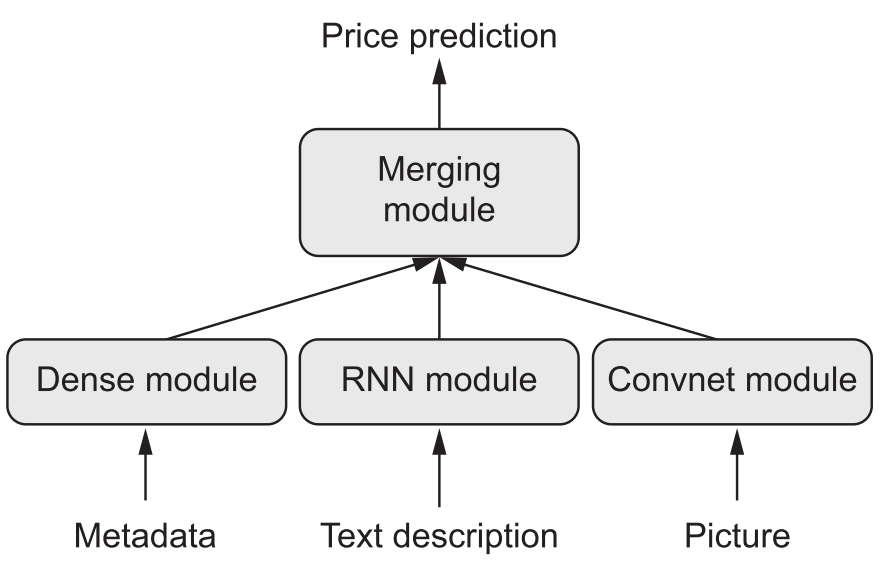
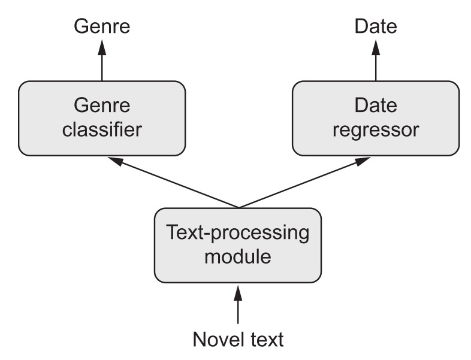
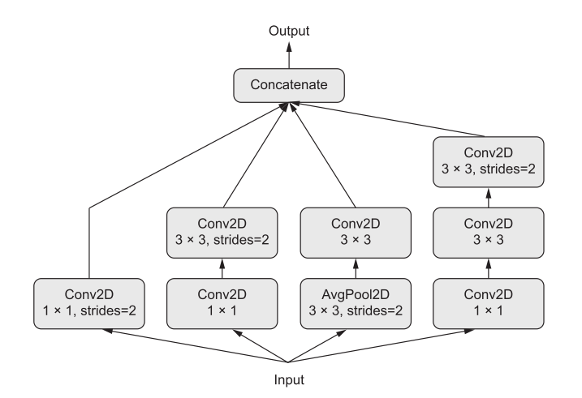

```{r setup, include=FALSE}
options(htmltools.dir.version = FALSE)
knitr::opts_chunk$set(eval = TRUE,
                      message = FALSE,
                      echo = TRUE,
                      warnings = FALSE,
                      fig.align = "center")
library(keras)
# library(plotly)
library(data.table)
# library(DiagrammeR)
```


# Chapter 7 Part 1 covers

* Multimodal models and the Keras funcional API
* Real-time model monitoring with Keras callbacks

---

# 7.1 Beyond sequential models and Keras functional API

All networks so far were sequential models with:

* exactly one input source
* exactly one output type
* sequential layers between

If one has input from different sources that require different kinds of neural 
layers or wants to get different kind of output one can instead use a **multimodal model**. 

{width=40%}

{width=40%}


### Neural Networks as Graphs


Neural network architecture can be any kind of DAG (directed graphs without loops).


---

## Implementing Multimodal Models with Keras functional API

* main function `keras_model(<input>,<output>)`
* define input shape 
* define output as a function of the input

```{r, echo=TRUE}
## traditional 
seq_model <- keras_model_sequential() %>% 
  layer_dense(units = 32, activation = "relu", input_shape = c(64)) %>% 
  layer_dense(units = 32, activation = "relu") %>% 
  layer_dense(units = 10, activation = "softmax")

## with functional API
input_tensor  <- layer_input(shape = c(64)) 
output_tensor <- input_tensor %>% 
  layer_dense(units = 32, activation = "relu") %>% 
  layer_dense(units = 32, activation = "relu") %>% 
  layer_dense(units = 10, activation = "softmax")
model <- keras_model(input_tensor, output_tensor)
```

$$\\[2cm]$$

Let's compare the model summaries:

```{r}
summary(seq_model)
summary(model)
```


## Compiling, Training, Evaluating `keras_model()`-Objects

This works essenially in the same way as for `keras_model_sequential()`.
If we have multiple inputs (or outputs), we need to specify them in a list.

```{r, echo=TRUE, eval=FALSE}
model %>% compile( 
  optimizer = "rmsprop", 
  loss = "categorical_crossentropy"
)

model %>% fit(
  list(input1, input2), 
  list(output1, output2), 
  epochs = 10, batch_size = 128) 

model %>% evaluate(list(input1, input2), 
                   list(output1, output2))
```


---

## Multi-input Models

#### Example: Question-answering model

Inputs are a **natural-language question** and a **text snippet**.
It is beneficial to preprocess question and text seperately before concatenating input information.


```{r}
library(keras)
text_vocabulary_size <- 10000 
ques_vocabulary_size <- 10000 
answer_vocabulary_size <- 50

text_input <- layer_input(shape = list(NULL), 
                          dtype = "int32", 
                          name  = "text")

encoded_text <- text_input %>% 
  layer_embedding(input_dim  = 64, 
                  output_dim = text_vocabulary_size) %>% 
  layer_lstm(units = 32)

question_input   <- layer_input(shape = list(NULL), 
                                dtype = "int32", 
                                name  = "question")

encoded_question <- question_input %>% 
  layer_embedding(input_dim  = 32, 
                  output_dim = ques_vocabulary_size) %>% 
  layer_lstm(units = 16)

concatenated <- layer_concatenate(list(encoded_text, 
                                       encoded_question)) 

answer       <- concatenated %>% 
  layer_dense(units      = answer_vocabulary_size, 
              activation = "softmax")

model <- keras_model(list(text_input, question_input), answer)
```

> Input is now a list of two. 
> Note there is another new function `layer_concatenate()`. 

$$\\[2cm]$$

Let's have a look at the model
```{r}
model 
```


<!-- ```{r} -->
<!-- model %>% compile(  -->
<!--   optimizer = "rmsprop",  -->
<!--   loss      = "categorical_crossentropy",  -->
<!--   metrics   = c("acc") -->
<!-- ) -->
<!-- ``` -->


<!-- ```{r} -->
<!-- num_samples <- 1000  -->
<!-- max_length  <- 100 -->
<!-- random_matrix <- function(range, nrow, ncol) {  -->
<!--   matrix(sample(range, size = nrow * ncol, replace = TRUE),  -->
<!--          nrow = nrow, ncol = ncol) -->
<!-- } -->

<!-- text     <- random_matrix(1:text_vocabulary_size, num_samples, max_length)  -->
<!-- question <- random_matrix(1:ques_vocabulary_size, num_samples, max_length)  -->
<!-- answers  <- random_matrix(0:1, num_samples, answer_vocabulary_size) -->

<!-- model %>% fit(  -->
<!--   list(text, question), answers,  -->
<!--   epochs = 10, batch_size = 128 -->
<!-- ) -->


<!-- model %>% fit(  -->
<!--   list(text = text, question = question),  -->
<!--   answers, epochs = 10, batch_size = 128 -->
<!-- ) -->
<!-- ``` -->


---

## Multi-output models

Similarly, we can use the `keras_model()` function to build multi-output models.
A multi-output model can be better performing than multiple separate models, esp. when
the outputs are correlated.

#### Example: 
Predict **age**, **gender** and **income level** form social media posts


When compiling multi-output models, one needs to define a loss function for each 
output, e.g.: 

```{r}
model %>% compile( optimizer = "rmsprop", 
                   loss = c("mse", "categorical_crossentropy", "binary_crossentropy"), 
                   loss_weights = c(0.25, 1, 10)
)
```

Important: Define loss weights. Since gradient descent minimises a *scalar*, the
losses need to be combined into a single value. 


---

## Neural Networks as Graphs

Neural network architecture can be any kind of DAG (directed graphs without loops).
Applications worth mentioning are 
### Inception Modules 
* first presented ~ 2013
* parallel convolutional branches
* branches vary in level of detail, i.e. there are branches for the "large scale features" 
and other branches for "fine-grained features" 
* better performance than sequential models



### Residual Connections 
* first presented ~2015
* connect an 'early' layer directly to a layer (much) further downstream
* helps against information loss (vanishing gradient problem)


### Prespecified DAGs

Many prespecified complex models are contained in `keras`, e.g.:
`application_inception_v3(), application_xception(), application_resnet50(), ... `


---

## Layer Weight Sharing - Reusing (parts of) a  Model

* We can reuse a layer, keeping the weights (instead of having multiple instances of the layer)
* This allows for models with shared branches.
  * share the same representations 
  * learn these representations simultaneously for different sets of inputs

#### Example: Assess semantic similarity between two sentences

* The two inputs are the two sentences
* The output is a similarity score between 0 and 1.
* Preprocessing of the two inputs can be combined.

### How to implement shared branches in keras

```{r}
lstm <- layer_lstm(units = 32) ## shared layer, only once instantiated

left_input   <- layer_input(shape = list(NULL, 128)) 
left_output  <- left_input %>% lstm()

right_input  <- layer_input(shape = list(NULL, 128)) 
right_output <- right_input %>% lstm()

merged <- layer_concatenate(list(left_output, right_output))

predictions <- merged %>% 
  layer_dense(units = 1, activation = "sigmoid")

model <- keras_model(list(left_input, right_input), predictions)
```

> Note that `lstm` has parentheses, `merged` does not.
(I'm unsure wheter these parentheses are really needed...)

> Note that the terms **merge** and **concatenate** are used interchangeably here, I'd say **concatenate** is more apt. 

$$\\[2cm]$$
Let's have a look at the model again:
```{r}
model
```


$$\\[2cm]$$

### Models as Layers

* We can think of a model *bigger layer* of an overarching model.
* Thus we can reuse a model within a larger model

```{r}
submodel <- application_xception() ## shared model, only once instantiated

left_input   <- layer_input(shape = c(299, 299, 3)) 
left_output  <- left_input %>% submodel()

right_input  <- layer_input(shape = c(299, 299, 3)) 
right_output <- right_input %>% submodel()
```

$$\\[3cm]$$

```{r ,echo=TRUE}
predictions <- layer_concatenate(list(left_output, right_output)) %>% 
  layer_dense(units = 1, activation = "sigmoid")

model <- keras_model(list(left_input, right_input), predictions)

model
```


---

# 7.2 Monitoring Models with Keras Callbacks & TensorBoard

## Callback while training a Model. Why and how to do it.

* Training a model can take rather long, with callbacks we can
  * Get insight into the training process in real-time.
  * Fine-tune "on the fly" (esp. adjust learning rate)
  * Logging progress, metrics 
  * ... 

To use callbacks, we have to pass a list with the specific callbacks to `fit()`
```{r, eval=FALSE}
my_callback_list <- list( 
  callback_early_stopping( 
    monitor = "acc",
    patience = 1),
  callback_reduce_lr_on_plateau(
    monitor = "val_loss", 
    factor = 0.1, 
    patience = 10)
)

model %>% fit( train, test, 
               ...,
               callbacks = my_callback_list)
```


---

## TensorBoard: TensorFlow Visualisation 

TensorBorard uses callbacks in a sophisticated manner that only works with the Tensorflow
backend.

>"Making progress is an iterative plocess, or loop: you start with an idea and 
express it as an experiment and process the information it generates." 

TensorBoard is all about processing the generated information. It allows us to:

* Visually monitoring metrics during training 
* Visualising your model architecture 
* Visualising histograms of activations and gradients 
* Exploring embeddings in 3D

### Using TensorBoard

Create a directory for the log files:
```{r, eval=FALSE}
dir.create("my_log_dir")
```

Create a callback
```{r, eval=FALSE}
tensorboard_callback <- list( 
  callback_tensorboard( 
    log_dir = "my_log_dir", 
    histogram_freq  = 1, 
    embeddings_freq = 1) 
)
```

Launch TensorBoard
```{r, eval=FALSE}
tensorboard("my_log_dir")
```

And then use the callback for the model fit
```{r, eval=FALSE}
model %>% fit(train, test,
              ...,
              callbacks= tensorboard_callback)
```


