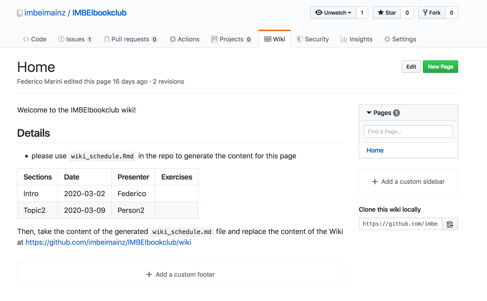
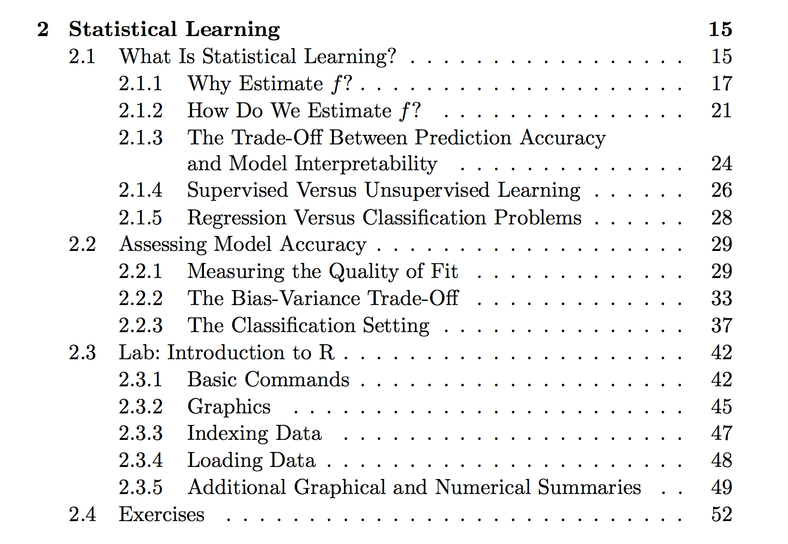

```{r setup, include=FALSE}
options(htmltools.dir.version = FALSE)
knitr::opts_chunk$set(
  eval = TRUE,
  message = FALSE,
  echo = TRUE,
  warnings = FALSE,
  fig.align = "center"
)
```

# Agenda

- Introductions
- The book
- Objectives
- Basic rules
- Guidelines and logistics
- Schedule
- Chapter 1: Introduction
- Tutorial: Creating and publishing presentations with R Studio

---

# Introductions

Who are you?

--

Why are you here?

--

"This book is intended for anyone who is interested in using modern statistical methods for modeling and prediction from data"

---

class: middle, center

# The book

### An Introduction to Statistical Learning - with Applications in R

Available at: http://faculty.marshall.usc.edu/gareth-james/ISL/ ("Download the book PDF")


---

# Why this book?

This book provides an introduction to statistical learning methods. It is aimed for upper level undergraduate students, masters students and Ph.D. students in the non-mathematical sciences.

--

"Anyone who wants to intelligently analyze complex data should own this book"

--

"It’s chock full of interesting examples  of how modern predictive machine learning algorithms work (and don’t work) in a variety of settings."

--

"it is by far the most well-written textbook I have ever used"

---

# Objectives

We want to...

- Discuss openly and collaboratively (and learn) about statistical methods for analyzing data

--

- Collaborate with our colleagues to better understand statistical concepts and its applications

--

- Collect some concrete hands-on experience on statistical analysis by following the labs in the book

--

- Your suggestions?


---

# Basic rules

We all need to stick to a set of rules if we want this meetings series to be effective and successful

- If you have questions, ask!
- If you know the answers, share them!
- If you cite copyrighted material, please appropriately reference your source(s)

--

My turn then:

This format for presenting and structuring the content is inspired by the format used by Levi Waldron (https://waldronlab.io/) for a similar book reading series (`data-science-seminar`)

--

### Requirements

- Willingness to learn
- Some familiarity with R

In-depth introduction to machine learning in 15 hours of expert videos: https://www.dataschool.io/15-hours-of-expert-machine-learning-videos/

---

# Guidelines and Logistics

https://github.com/imbeimainz/IMBEIbookclub


---

# Guidelines and Logistics

https://github.com/imbeimainz/IMBEIbookclub

Time: Mondays, 13.15 - 14.45
Where: IMBEI Sitzungssaal (Building 902)

Communications: 

Proposal: the channel `#bookclub` in the Slack workspace https://imbeibiostats-bioinfo.slack.com (send me an email for receiving the invitation)

Sharing code, outputs:

https://github.com/imbeimainz/IMBEIbookclub - please respect the folder structure


---

# Schedule

https://github.com/imbeimainz/IMBEIbookclub/wiki



---

class: inverse, center, middle

# Chapter 1:  Introduction

---

# Statistical learning

**Statistical learning**: toolset for understanding data

--

- supervised methods: build a statistical model to predict/estimate an output based on more inputs
- unsupervised methods: no expected outputs, learn relationships and structure 

--

Strong accent: use real-world data sets to explain the concepts

---

# History

**Statistical learning**: recently conceived

* 19th century - Legendre and Gauss: *Method of least squares* (early Linear Regression) – Predicting quantitative values

--

* 1936 - Fisher: *Linear Discriminant Analysis* – Predicting qualitative values

--

* 1940:  *Logistic regression* – Predicting qualitative values

--

* 1970s - Nelder and Wedderburn: *Generalized linear models* - Predicting quantitative and qualitative values. Linear only - computational feasibility was the problem!

--

* 1980s - Breiman, Friedman, Olshen, Stone: *classification and regression trees* (non-linear relationships)

--

* 1986 - Hastie and Tibshirani: *generalized additive models* (non-linear extensions to generalized linear models) + software implementations!

--

* More recently: machine learning - statistical learning as a subfield of statistics

--

`R`: powerful, user friendly, freely available software

---

# ISL and ESL

**ESL** (2001): comprehensive intro on the topic, but now audience is wider

Purpose of **ISL**: assist transition of statistical learning from academic to mainstream field

Aim: understand models, intuitions, pros and cons of various approaches

--

- methods relevant to many academic and non- disciplines
- present the methods to best choose which box to use: models, intuition, assumptions, tradeoffs
- not too deep into technical details, some math familiarity is assumed
- application to real world problems - R computer labs for each chapter!

---

# About the conventions

$n$ observations

$p$ variables

`Variable name`

$x_{i j}$, i from 1 to $n$, j from 1 to $p$

$$\mathbf{X}=\left(\begin{array}{cccc}
{x_{11}} & {x_{12}} & {\dots} & {x_{1 p}} \\
{x_{21}} & {x_{22}} & {\dots} & {x_{2 p}} \\
{\vdots} & {\vdots} & {\ddots} & {\vdots} \\
{x_{n 1}} & {x_{n 2}} & {\dots} & {x_{n p}}
\end{array}\right)$$

--

My trick: MathPix, a life saver (or at least, a time saver!)

---

# About the conventions

.pull-left[
$i$th observation

$$x_{i}=\left(\begin{array}{c}
{x_{i 1}} \\
{x_{i 2}} \\
{\vdots} \\
{x_{i p}}
\end{array}\right)$$

]

.pull-right[
$j$th variable

$$\mathbf{x}_{j}=\left(\begin{array}{c}
{x_{1 j}} \\
{x_{2 j}} \\
{\vdots} \\
{x_{n j}}
\end{array}\right)$$

]

---

# About the conventions

.pull-left[
$\mathbf{y}$, our output

$$\mathbf{y}=\left(\begin{array}{c}
{y_{1}} \\
{y_{2}} \\
{\vdots} \\
{y_{n}}
\end{array}\right)$$

]

.pull-right[
a vector of length $n$

$$\mathbf{a}=\left(\begin{array}{c}
{a_{1}} \\
{a_{2}} \\
{\vdots} \\
{a_{n}}
\end{array}\right)$$

]

---

# About the conventions

- matrix $\mathbf{A}$
- random variable  $A$
- scalar $a$

Dimensions:

$a \in \mathbb{R}^{k}$

$\mathbf{A} \in \mathbb{R}^{r \times s}$

--

Avoided using matrix algebra *whenever possible*

---

# There's more than just the book

`ISLR` package as a companion + `MASS` (`Boston`) + base `R` (`USArrests`)

```{r eval = FALSE}
install.packages("ISLR")
```

```{r}
library("ISLR")
d <- data(package = "ISLR")
d$results[, c("Item", "Title")]
```

---

# `Wage`

```{r}
colnames(Wage)
```

Wage data

Source: Data from group of males from the Atlantic region of the United States

Variables: Wages, age, year of wage, and education.

Aim: understand the association between an employee’s wage and age, year of wage, and education (linear regression)

---

# `Smarket`

```{r}
colnames(Smarket)
```

Stock Market Data

Source: Data from the daily movements in the Standard & Poor’s 500 (S&P) stock index over a 5-year period between 2001 and 2005.

Variables: Daily Index, time variable

Aim: to predict whether the index will increase or decrease on a given day using the past 5 days' percentage changes in the index (predict a categorical output, classification problem)

---

# `NCI60`

```{r}
str(NCI60)
```

Gene Expression Data

Source: 6830 gene expression measurements for each of 64 cancer cell lines

Aim: determining whether there are groups, or clusters, among the cell lines based on their gene expression measurements (many dimensions, loss of info but visualize via PCA)

---

class: middle, center

# Practicing what I preach

---

```{r}
library(ggplot2)
theme_set(theme_bw())
ggplot(Wage,
       aes(x = age, y = wage)) + 
  geom_point() + 
  geom_smooth()
```

---

```{r}
ggplot(Wage,
       aes(x = year, y = wage)) + 
  geom_point() 
```

---

```{r}
ggplot(Wage,
       aes(x = year, y = wage)) + 
  geom_jitter() 
```

---

```{r}
ggplot(Wage,
       aes(x = year, y = wage, group = year)) + 
  ggforce::geom_sina() 
```

---

```{r}
ggplot(Wage,
       aes(x = education, y = wage, fill = education)) + 
  geom_boxplot()
```

---

```{r}
ggplot(Wage,
       aes(x = education, y = wage, fill = education)) + 
  geom_violin()
```

---

# Practicing what I preach - part 2

```{r warning=FALSE, message=FALSE, eval=FALSE}
dim(NCI60$data)
head(NCI60$labs)
```


```{r warning=FALSE, message=FALSE, fig.height=4}
library(SummarizedExperiment)
se <- SummarizedExperiment(assays = List(counts = t(NCI60$data)))
tse <- DESeq2::DESeqTransform(se)
tse$label <- NCI60$labs
pcaExplorer::pcaplot(tse, "label", text_labels = FALSE, ellipse = FALSE)
```


---

# Tutorial: Creating an Rmd presentation with R Studio

I'll guide you through this!

--

(I can also show you how this presentation looks like!)

--

For Git & GitHub: excellent overview presentation!

http://brunaw.com/slides/git-workshop/git-workshop.html

---

class: middle, center

# Thank you all for your attention!

Next meeting: March, 9 2020




