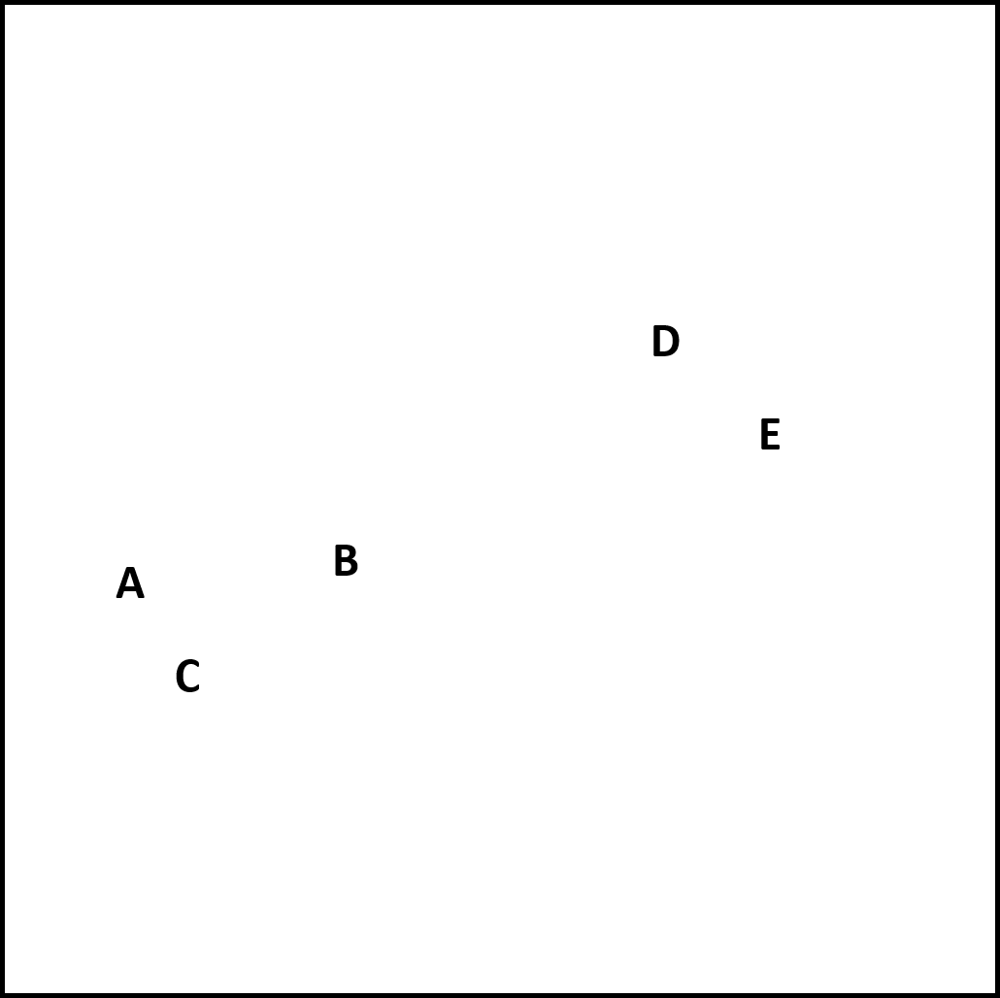
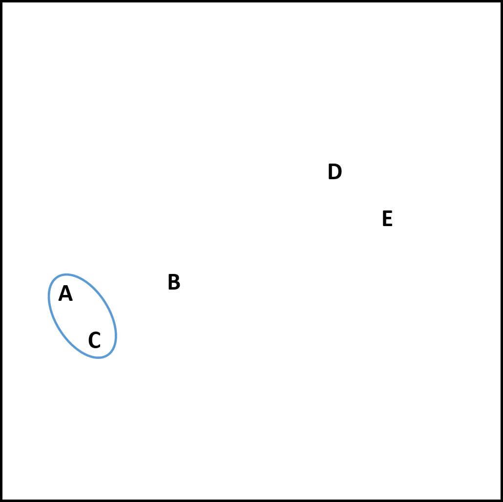
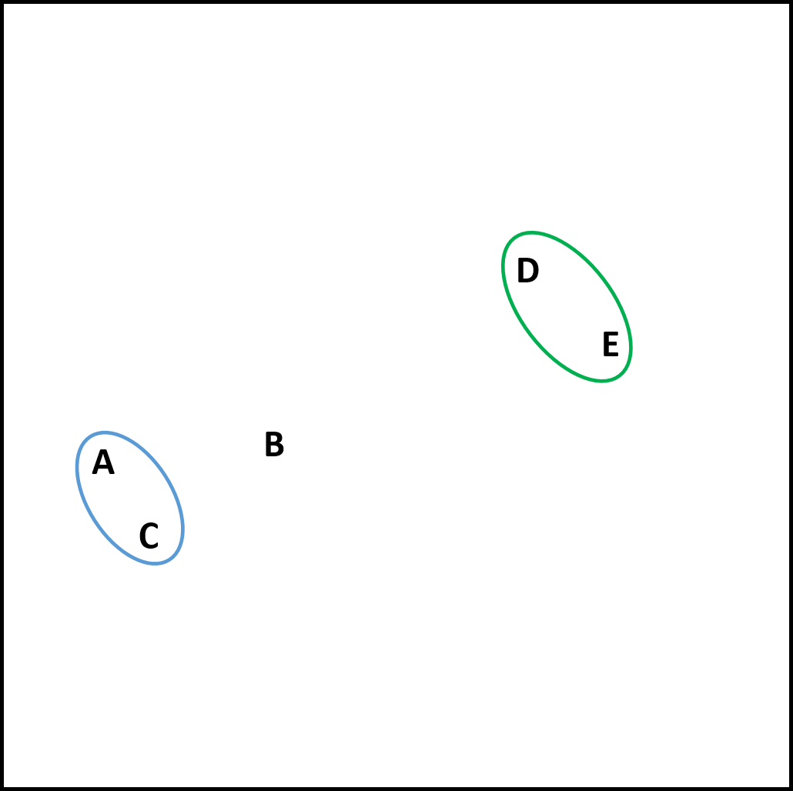
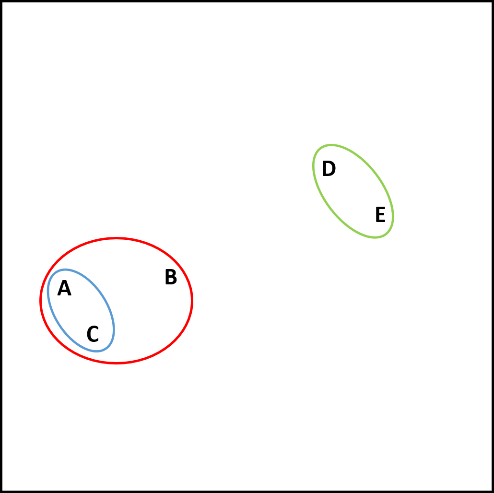
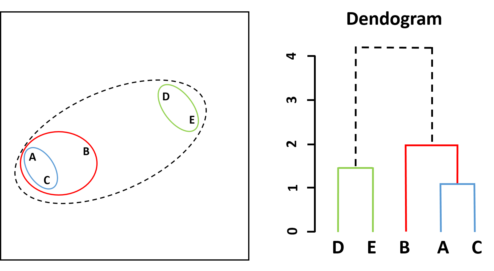
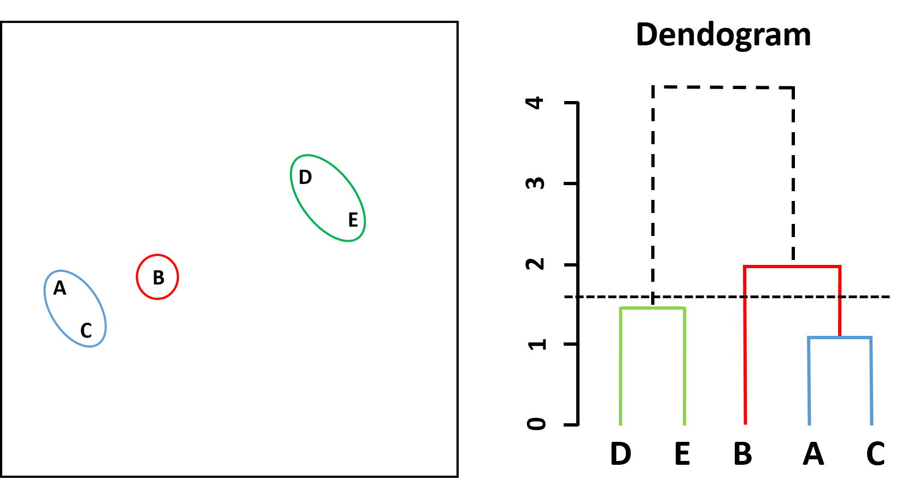
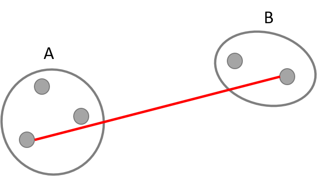
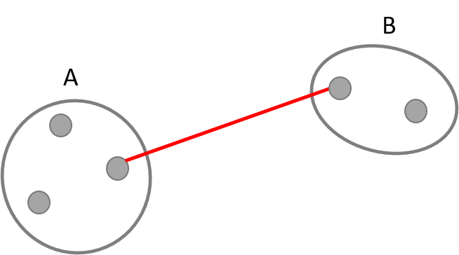
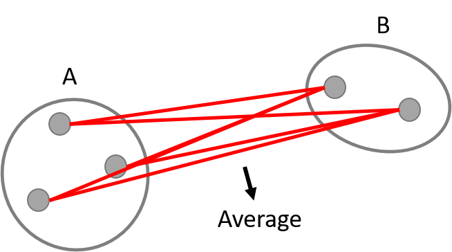
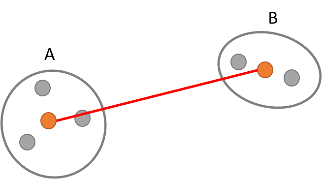

```{r setup, include=FALSE}
options(htmltools.dir.version = FALSE)
knitr::opts_chunk$set(
  eval = TRUE,
  message = FALSE,
  echo = TRUE,
  warnings = TRUE,
  fig.align = "center"
)
```


```{r setup2, include=FALSE}
library(ISLR)
library(readr)
library(lattice)
library(knitr)
```

class: center, middle

# Chapter 10:  Unsupervised Learning 
## Clustering Methods

---

# Clustering
* $\color{green}{\textit{Clustering}}$ refers to a very broad set of techniques for finding $\color{green}{\textit{subgroups}}$, or $\color{green}{\textit{clusters}}$, in a data set.

* We seek to partition them into distinct groups so that the observations within each group are quite similar to each other.

* We must define what it means for two or more observations to be $\color{green}{\textit{similar}}$ or $\color{green}{\textit{different}}$.

* Indeed, this is often a domain-specific consideration that must be made based on knowledge of the data being studied.

* E.g. find subgroups of breast cancer with $\color{green}{\textit{n observations}}$ (cancer patient) and $\color{green}{\textit{p features}}$ (measurements like RNA-seq).

---

# PCA vs. Clustering

* PCA looks to find a low-dimensional representation of the observations that explain a good fraction of the variance.

* Clustering looks to find homogeneous subgroups among the observations.

---

# Two best-known clustering methods

* In $\color{green}{\textit{K-means clustering}}$, we seek to partition the observations into a $\color{green}{\textit{pre-specified number of clusters}}$.

* In $\color{green}{\textit{hierarchical clustering}}$, we do not know in advance how many clusters we want; in fact, we end up with a tree-like visual representation of the observations, called a $\color{green}{\textit{dendrogram}}$, that allows us to view at once the clusterings obtained for $\color{green}{\textit{each possible number of clusters}}$, from 1 to n.

---

# *K*-Means Clustering


A simulated data set with 150 observations in two-dimensional space (2 features).

---

# Details of *K*-means clustering

Let $C_{1}, \dots, C_{K}$ denote sets containing the indices of the observations in each cluster. These sets satisfy two properties:

1. $C_{1} \cup C_{2} \cup \ldots \cup C_{K}=\{1, \ldots, n\}$.

  In other words, each observation belongs to at least one of the K clusters.

2. $C_{k} \cap C_{k^{\prime}}=\emptyset \text { for all } k \neq k^{\prime}$.

  In other words, the clusters are nonoverlapping: no observation belongs to more than one cluster.
  
For instance, if the *i*th observation is in the *k*th cluster, then $i \in C_{k}$.

---

# Details of *K*-means clustering

* The idea behind *K*-means clustering is that a $\color{green}{\textit{good}}$ clustering is one for which the $\color{green}{\textit{within-cluster variation}}$ is as small as possible. 

* The within-cluster variation for cluster $C_{k}$ is a measure $W\left(C_{k}\right)$ of the amount by which the observations within a cluster differ from each other. 

* Hence we want to solve the problem

$$\begin{aligned}
\operatorname{minimize}_{C_{1}, \ldots, C_{K}}\left\{\sum_{k=1}^{K} W\left(C_{k}\right)\right\}
\end{aligned}$$

  In other words, we want to partition the observations into *K* clusters such that the total within-cluster variation, summed over all *K* clusters, is as small as possible.
      
---

# How to define within-cluster variation?

* Typically we use $\color{green}{\textit{Euclidean distance}}$

$$\begin{aligned}
W\left(C_{k}\right)=\frac{1}{\left|C_{k}\right|} \sum_{i, i^{\prime} \in C_{k}} \sum_{j=1}^{p}\left(x_{i j}-x_{i^{\prime} j}\right)^{2}
\end{aligned}$$

  where $\left|C_{k}\right|$ denotes the number of observations in the *k*th cluster.
  
--
  
* Combining the equations gives the optimization problem that defines *K*-means clustering

$$\begin{aligned}
\operatorname{minimize}_{C_{1}, \ldots, C_{K}}\left\{\sum_{k=1}^{K} \frac{1}{\left|C_{k}\right|} \sum_{i, i^{\prime} \in C_{k}} \sum_{j=1}^{p}\left(x_{i j}-x_{i^{\prime} j}\right)^{2}\right\}
\end{aligned}$$

---

# *K*-means Clustering Algorithm

1. Randomly assign a number, from 1 to *K*, to each of the observations. These serve as initial cluster assignments for the observations.

2. Iterate until the cluster assignments stop changing:

    (a) For each of the *K* clusters, compute the cluster $\color{green}{\textit{centroid}}$. The *k*th cluster centroid is the vector of the *p* feature means for the observations in the *k*th cluster.

```{r  out.width = "70%", echo=FALSE}
include_graphics("images/Fig.10.6_1.png") 
```


---

# *K*-means Clustering Algorithm

<ol start=2>
<li> Iterate until the cluster assignments stop changing:

  (a) For each of the *K* clusters, compute the cluster $\color{green}{\textit{centroid}}$. 

  (b) Assign each observation to the cluster whose centroid is closest (where closest is defined using Euclidean distance).


---

# Properties of the algorithm

* The algorithm is guaranteed to decrease the value of the the *K*-means optimization problem at each step, as

$$\begin{aligned}
\frac{1}{\left|C_{k}\right|} \sum_{i, i^{\prime} \in C_{k}} \sum_{j=1}^{p}\left(x_{i j}-x_{i^{\prime} j}\right)^{2}=2 \sum_{i \in C_{k}} \sum_{j=1}^{p}\left(x_{i j}-\bar{x}_{k j}\right)^{2}
\end{aligned}$$

  where $\bar{x}_{k j}=\frac{1}{\left|C_{k}\right|} \sum_{i \in C_{k}} x_{i j}$ is the mean for feature *j* in cluster C_{k}.

* Howewer, it is not guaranteed to give the global minimum.

---

# *K*-means Clustering Algorithm

* The results obtained will depend on the initial (random) cluster assignment of each observation in Step 1.

* Therefore run the algorithm multiple times and select best solution.

```{r  out.width = "50%", echo=FALSE}
include_graphics("images/Fig.10.7.png") 
```

---

# Hirarchical Clustering

*  *K*-means clustering requires us to pre-specify the number of clusters *K*. 

* $\color{green}{\textit{hierarchical clustering}}$ is an alternative approach which does not require that we commit to a particular
choice of *K*. 

* It results in a tree-based representation of the observations, called a $\color{green}{\textit{dendrogram}}$, that allows us to view at once the clusterings obtained for $\color{green}{\textit{each possible number of clusters}}$, from 1 to n. 

* In this section, we describe $\color{green}{\textit{bottom-up}}$ or $\color{green}{\textit{agglomerative}}$ clustering (most common), this refers to the fact that a dendrogram is built starting from the leaves and combining clusters up to the trunk.

---

# Hirarchical Clustering Algorithm

Builds a hierarchy in a *bottom-up* fashion:

```{r  out.width = "50%", echo=FALSE}
 
```

---

# Hirarchical Clustering Algorithm

Builds a hierarchy in a *bottom-up* fashion:

```{r  out.width = "50%", echo=FALSE}
 
```

---

# Hirarchical Clustering Algorithm

Builds a hierarchy in a *bottom-up* fashion:

```{r  out.width = "50%", echo=FALSE}
 
```

---

# Hirarchical Clustering Algorithm

Builds a hierarchy in a *bottom-up* fashion:

```{r  out.width = "50%", echo=FALSE}
 
```

---

# Hirarchical Clustering Algorithm

Builds a hierarchy in a *bottom-up* fashion:

```{r  out.width = "50%", echo=FALSE}
 
```

---

# Hirarchical Clustering Algorithm

The approach in words:

1. Start with each point as a cluster and measure all pairwise dissimilarities (e.g. using Euclidean distance).

2. For i=n, n-1, ...2:

  (a) Examine all pairwise inter-cluster dissimilarities among the i clusters and identify the pair of clusters that are least dissimilar. Fuse these two clusters. The dissimilarity between these two clusters indicates the height in the dendrogram at which the fusion should be placed.
  
  (b) Compute the new pairwise inter-cluster dissimilarities among
the i − 1 remaining clusters.

---

# Interpretation

```{r  out.width = "90%", echo=FALSE}
 
```

---

# Interpretation

```{r  out.width = "90%", echo=FALSE}
include_graphics("images/HC_Ex1_6b.png") 
```


We draw conclusions about the similarity of two observations based on the location on the vertical axis where branches containing those two observations first are fused.
---

# Interpretation

```{r  out.width = "90%", echo=FALSE}
 
```

We draw conclusions about the similarity of two observations based on the location on the vertical axis where branches containing those two observations first are fused.
---

# Linkage

Dissimilarity between two groups of observations is measured by linkage.


Common types of linkage:
  + complete
  + average
  + single
  + centroid

---

# Types of linkage
## Complete

```{r  out.width = "40%", echo=FALSE}
 
```


Maximal intercluster dissimilarity. 

Compute all pairwise dissimilarities between the observations in cluster A and the observations in cluster B, and record the $\color{green}{\textit{largest}}$ of these dissimilarities.

---

# Types of linkage
## Single

```{r  out.width = "40%", echo=FALSE}
 
```


Minimal intercluster dissimilarity. 

Compute all pairwise dissimilarities between the observations in cluster A and the observations in cluster B, and record the $\color{green}{\textit{smallest}}$ of these
dissimilarities. Single linkage can result in extended, trailing clusters in which single observations are fused one-at-a-time.

---

# Types of linkage
## Average

```{r  out.width = "40%", echo=FALSE}
 
```


Mean intercluster dissimilarity. 

Compute all pairwise dissimilarities between the observations in cluster A and the observations in cluster B, and record the $\color{green}{\textit{average}}$ of these dissimilarities.

---

# Types of linkage
## Centroid

```{r  out.width = "40%", echo=FALSE}
 
```


Dissimilarity between the centroid for cluster A (a mean vector of length p) and the centroid for cluster B. 

* Not monotonic, subject to $\color{green}{\textit{inversions}}$: The combination similarity can increase during the clustering.

* Violates the fundamental assumption that small clusters are more coherent than large clusters.

---

# Types of linkage
## Centroid

```{r , fig.width = 9, fig.height = 5, echo=FALSE}
simple.data = data.frame(
  x = c(0,1,0.5),
  y = c(0,0,0.9)
)

simple.data2 = data.frame(
  x = c(0,1,0.5,0.5),
  y = c(0,0,0.9,0)
)

par(mfrow = c(1,2))
plot(simple.data2, xlab = "Dimension 1", ylab = "Dimension 2")
text(simple.data2[1,], labels = 1, pos = 3)
text(simple.data2[2,], labels = 2, pos = 3)
text(simple.data2[3,], labels = 3, pos = 1)
text(simple.data2[4,], labels = "centroid", pos = 3, col = "red")

eucl <- dist(simple.data, method = "euclidean")
agglo <-  hclust(eucl, method = "centroid")

par(mar = c(2,4,1,1))
plot(as.dendrogram(agglo), main = "Dendrogram", ylab = "Height", ylim = c(0,1))
```

---

# Choice of linkage

Average, complete, and single linkage applied to an example data set:

```{r  out.width = "70%", echo=FALSE}
include_graphics("images/Fig.10.12.png") 
```

Average and complete linkage tend to yield more balanced clusters.

---

# Choice of Dissimilarity Measure

* Why not always use Euclidean distance as the dissimilarity measure?

* Correlation-based distance considers two observations to be similar if their features are highly correlated, even though the observed values may be far apart in terms of Euclidean distance.

* This is an unusual use of correlation, which is normally computed between variables; here it is computed between the observation profiles for each pair of observations.

```{r  out.width = "50%", echo=FALSE}
include_graphics("images/Fig.10.13.png") 
```

---

# Practical Issues

## Small Decisions with Big Consequences

* Should the observations or features first be standardized in some way? For instance, maybe the variables should be centered to have mean zero and scaled to have standard deviation one.

* In the case of hierarchical clustering:
  + What dissimilarity measure should be used?
  + What type of linkage should be used?
  + Where should we cut the dendrogramin order to obtain clusters?
  
```{r  out.width = "30%", echo=FALSE}
include_graphics("images/Fig.10.9.png") 
```

* In the case of K-means clustering: 
  + How many clusters should we look for in the data?

---

# Other Considerations in Clustering

* Both K-means and hierarchical clustering will assign each observation to a cluster. However, sometimes this might not be appropriate.
    + Clusters found may be heavily distorted due to the presence of outliers that do not belong to any cluster.
    
* Clustering methods generally are not very robust. Removing a subset of the n observations at random often leads to different clusters. 

* Be careful about interpretation, do not take results as the absolute truth.

* Performe analysis with different choices of parameters (standardization, linkage) and on different subsets.

---
class: middle, center

# Thanks!
