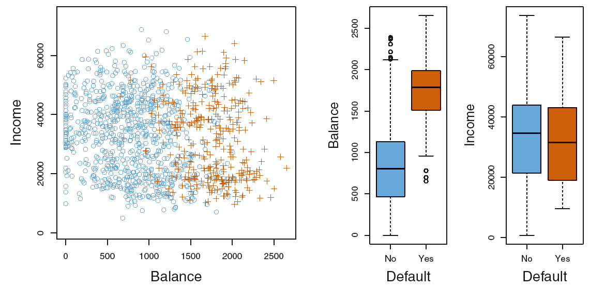
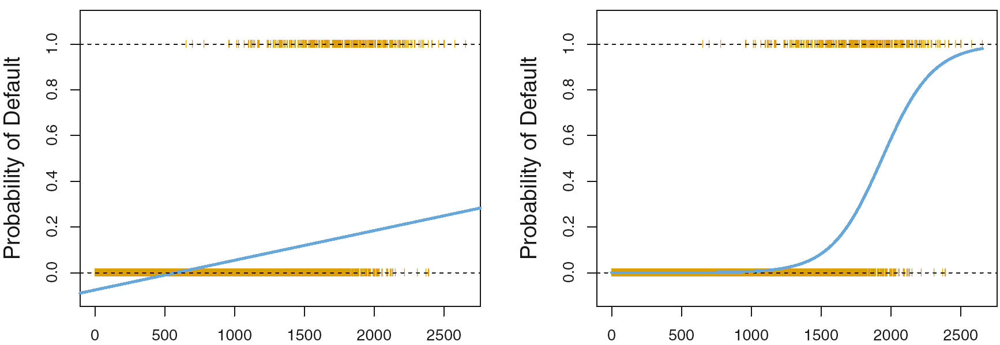
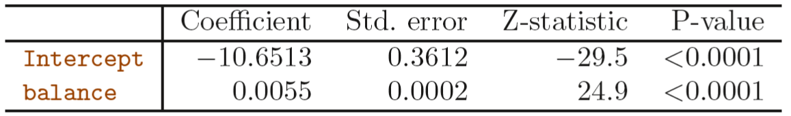
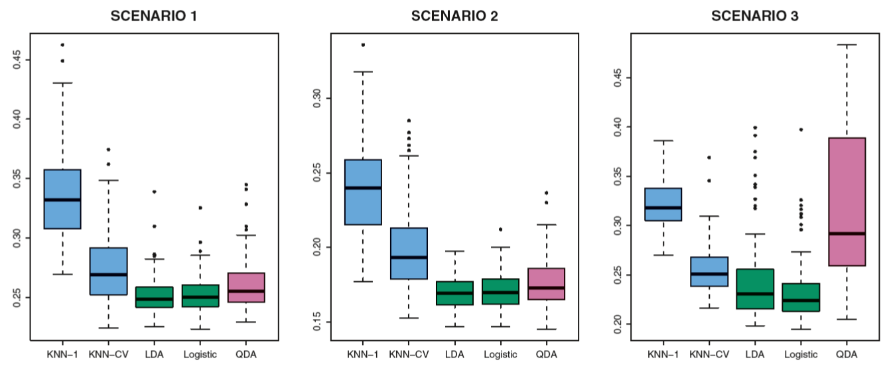
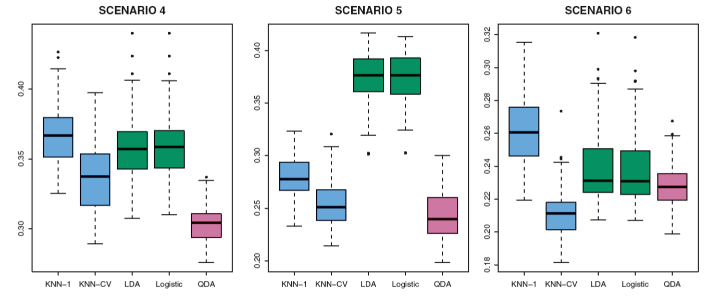

---
title: "Logistic Regression"
author: "Jochem König"
date: "30 März 2020"
output: slidy_presentation
---
<!-- --- -->
<!-- title: "Chapter 4" -->
<!-- subtitle: " Regression" -->
<!-- author: "Jochem Konig (koenigjo@uni-mainz.de)</br>" -->
<!-- date: "2020/03/30</br> -->
<!--   IMBEI - University Medical Center Mainz" -->
<!-- output: -->
<!--   xaringan::moon_reader: -->
<!--     css: ["default", "default-fonts","css/FMstyles.css","css/animate.css"] -->
<!--     lib_dir: libs -->
<!--     nature: -->
<!--       highlightStyle: github -->
<!--       highlightLines: true -->
<!--       countIncrementalSlides: false -->
<!--       titleSlideClass: [center, middle] -->
<!-- --- -->
```{r setup, include=FALSE}
library(rgl)
library(knitr)
library(pander)
panderOptions("missing","")
options(htmltools.dir.version = FALSE)
knitr::opts_chunk$set(
  eval = TRUE,
  message = FALSE,
  echo = FALSE,
  warnings = FALSE,
  fig.align = "center",
  warning = FALSE,
  error = FALSE
)
opts_knit$set(root.dir = "../..") ## knit in grand-parent folder for the sake of easy (and consistent!) data access
```

# 4.1 Overview of Classification

- Predict categorical outcome based on a classified training sample 
$$(x_1,y_1),\ldots,(x_n,y_n)$$
- Today: logistic regression, linear and quadratic discriminant analysis, (k-NN)
- Later: generalized additive models, trees, random forests, boosting, SVM

---

## Examples

- Triage: Attribute emergency room arrivals to three conditions ...
- Online banking service: predict fraudulent transactions by IP address, transaction history etc.
- Find DNA features that disrciminate between some disease and controls

---

## The default data set
- predict defaulting in a given month for credit card holders by balance, income and student status
<!-- `` -->



---

## 4.2 Why not linear regression?


- Outcome coded as $\{1,2,3\}$ may not be ordinal.
- ... and not be metric
- Modeling posteriors $P(y=1\mid x)$ by linear regression may give predictes probabilities outside $[0,1].$ 
- However:
-- binary outcome with linear regression gives the same classifier as LDA



---

# The logistic model

$$p(X)={\rm Pr}({\rm default}={\rm Yes} \mid {\rm balance}) = \frac{e^{\beta_0+\beta_1X}}{1+e^{\beta_0+\beta_1X}}$$

--

$$ \log\left( \frac{p(X)}{1-p(X)}\right)=\beta_0+\beta_1X$$

--

Likelihood to be maximized

$${\mathcal l}(\beta_0,\beta_1)=\prod_{i:y_i=1}p(x_i)\prod_{i\prime:y_{i\prime}=0}p(x_{i\prime})$$

--



---

# Model based prediction via plug in

$$\hat p(X=1000)= \frac{e^{\hat\beta_0+\hat\beta_1X}}{1+e^{\hat\beta_0+\hat\beta_1X}}=\frac{e^{-10.6513+0.0055\times 1000}}{1+e^{-10.6513+0.0055\times 1000}}=0.00576$$

- Model for factor Student:

$$\hat{\rm Pr}({\rm default}={\rm Yes} \mid {\rm student}={\rm Yes}) = \frac{e^{-3.5041+0.4049\times 1}}{1+e^{-3.5041+0.4049\times 1}}=0.0431$$
$$\hat{\rm Pr}({\rm default}={\rm Yes} \mid {\rm student}={\rm No}) = \frac{e^{-3.5041+0.4049\times 0}}{1+e^{-3.5041+0.4049\times 0}}=0.0292$$
---

# Multivariable logistic regression

- Model
$$p(X)= \frac{e^{\beta_0+\beta_1X_1 + \cdots +\beta_pX_p }}{1+e^{\beta_0+\beta_1X+ \cdots +\beta_pX_p }}$$
- Fitting the full Default data linearly


- role of Student is reversed.
- given Balance (higher in students!) studentship reduces Defaulting probability
- CONFOUNDING

---

#Predictions

- univariable (marginally)

$$\hat{\rm Pr}({\rm default}={\rm Yes} \mid {\rm student}={\rm Yes}) = \frac{e^{-3.5041+0.4049\times 1}}{1+e^{-3.5041+0.4049\times 1}}=0.0431$$

$$\hat{\rm Pr}({\rm default}={\rm Yes} \mid {\rm student}={\rm No}) = \frac{e^{-3.5041+0.4049\times 0}}{1+e^{-3.5041+0.4049\times 0}}=0.0292$$
- multivariable (conditionally)

$$\hat p(X_1=1500,X_2=40,X_3={\rm Yes})=\frac{e^{-10.869+0.00574\times 1500+0.003\times 40-0.6468\times 1}}{1+e^{-10.869+0.00574\times 1500+0.003\times 40-0.6468\times 1}}=0.058$$

$$\hat p(X_1=1500,X_2=40,X_3={\rm Yes})=\frac{e^{-10.869+0.00574\times 1500+0.003\times 40-0.6468\times 0}}{1+e^{-10.869+0.00574\times 1500+0.003\times 40-0.6468\times 0}}=0.105$$


---

# ... 

$${\rm \Large Questions, comments?}$$

---

# Chapter 4.5 Comparison

- Under homegenous normality assumptions with two classes, the logistic model is valid.
- Both, LDA and logistic ML-fit estimate the same conditional probality function (Posterior)
- Model assumption for LDA are more restrictive
- Estimates of LDA are more precise if assumptions hold
- LDA does not suffer from the risk of 'complete separation'

---

# Some Monte Carlo simuation games
Scenarios 
1. $n=20+20$, two independent normal variables.
2. Same, but $r(X_1,X_2\mid Y)=-0.5 , -> better separation
3. $n=50+50$ Both variables t-distributed, 



---

# More

Scenarios 
4. $r(X_1,X_2\mid Y=1)=0.5, r(X_1,X_2\mid Y=2)=-0.5$
5. Uncorrelated normal predictors within class(?), Response modelled with quadratic terms $X_1^2 ,X_2^2, X_1X_2$
6. Same with even more fancy response function 




---