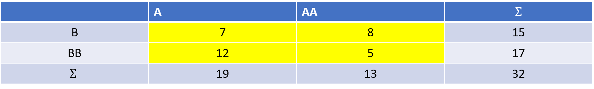
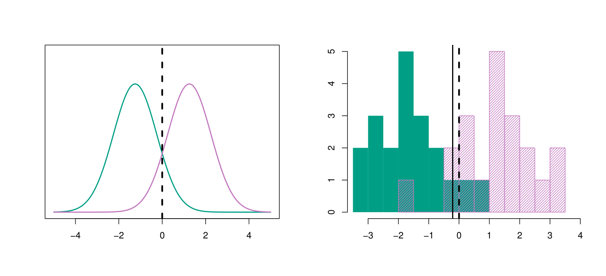
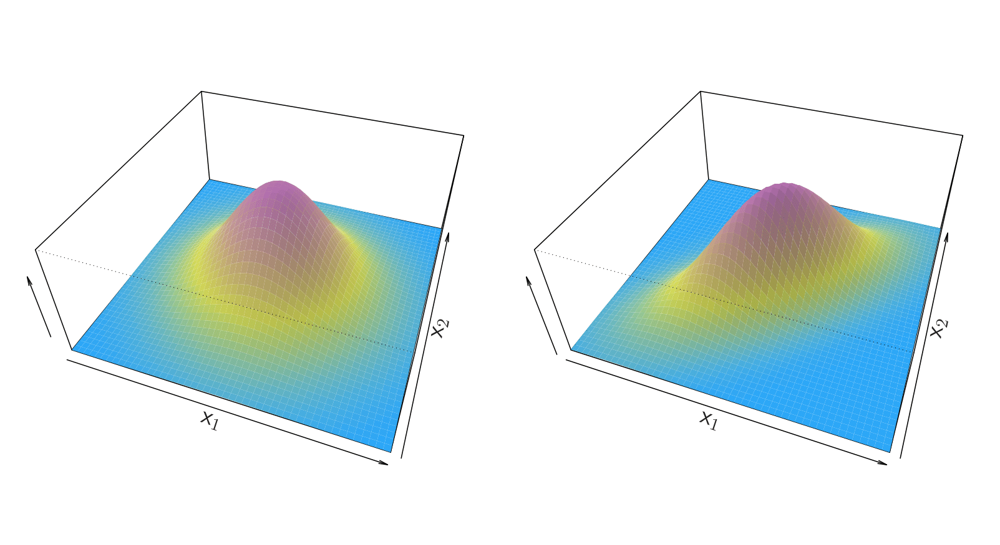
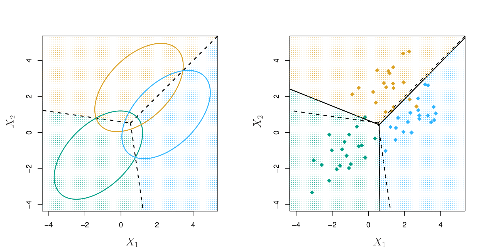
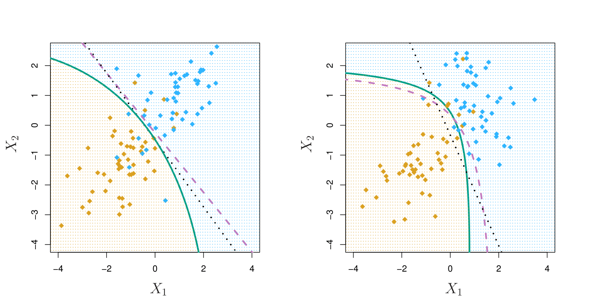

```{r setup, include=FALSE}
options(htmltools.dir.version = FALSE)
knitr::opts_chunk$set(
  eval = TRUE,
  message = FALSE,
  echo = TRUE,
  warnings = FALSE,
  fig.align = "center"
)
```

# What is it?

--


*  Classification Method 

--

*  Used when we classify with regard to  K >= 3  classes

--
  
* Linear Discriminant Analysis (LDA) < = > Quadratic Discriminant Analysis (QDA)

--

* Based (Bayesed ^^) on Bayes’ Theorem


---

# Prelude, Bayes‘ Theorem (Baysics ^^)

## Law of Conditional Probability

$$P(A|B) = \frac{P(A \cap B)}{P(B)}$$
--


--

$$P(A|B) = \frac{\frac{7}{32}}{\frac{15}{32}} = \frac{7}{15}$$
---

## Law of Conditional Probability, Continued

$$P(B|A) = \frac{P(B \cap A)}{P(A)} <=> P(B \cap A) = P(B|A)P(A)$$
--
$$P(A|B) = \frac{P(B|A)P(A)}{P(B)}$$
--


--

$$P(A|B) = \frac{\frac{7}{19}\frac{19}{32}}{\frac{15}{32}}=\frac{7}{15}$$

---
## Law of Conditional Probability + Law of Total Probability

$$P(A|B) = \frac{P(B|A)P(A)}{P(B|A)P(A) + P(B|AA)P(AA)}$$
--

--

$$P(A|B) = \frac{\frac{7}{19}\frac{19}{32}}{\frac{7}{19}\frac{19}{32} + \frac{8}{13}\frac{13}{32}} = \frac{\frac{7}{19}\frac{19}{32}}{\frac{15}{32}}=\frac{7}{15}$$
---
## Bayesian Statistics

$$P(\Theta|X) = \frac{P(X|\Theta)P(\Theta)}{P(X)}$$
---

## Bayesian Statistics, Example

--

$$P(X = x) = {n \choose x}p_H^xp_T^{n-x}$$
--

$$P(X = x) = {n \choose x}0.5^x0.5^{n-x}$$

--

$$P(X = x) = {n \choose x}0.2^x0.8^{n-x}$$
--

Throw on Coin 10 Times, Observe 6 Times Head. Which Coin was it?

--

$$P(X|p_H=0.5,p_T=0.5) = {10 \choose 6}0.5^60.5^4 \approx 0.2051$$

--

$$P(X|p_H=0.2,p_T=0.8) = {10 \choose 6}0.2^60.8^4 \approx 0.0055$$

---

## Bayesian Statistics, Example Continued

$$P(p_H=0.2,p_T=0.8|X) \propto 0.0055 * 0.5 \approx 0.0028$$

--

$$P(p_H=0.5,p_T=0.5|X)\propto 0.2051 * 0.5 \approx 0.1025$$

--

$$P(p_H=0.2,p_T=0.8|X)\approx0.1025/(0.0028 + 0.1025) \approx 0.026$$

--

$$P(p_H=0.5,p_T=0.5|X)\approx0.1025/(0.0028 + 0.1025) \approx 0.974$$

--

=> Choose the normal coin


---

## Discriminant Analysis

$$p_k=P(Y=k|X=x)$$ 

<br>
<br>
<br>

--
$$f_k(x)=P(X=x|Y=k)$$ 
--
<br>
$$p_k(x)=P(Y=k|X=x)=\frac{P(X =x|Y=k)P(Y=k)}{P(X=x)}$$
<br>
--
$$p_k(x)=P(Y=k|X=x)=\frac{\pi_kf_k(x)}{\sum_{l=1}^K\pi_lf_l(x)}$$
<br>
---

$$f_k(x)=\frac{1}{\sqrt{2\pi}\sigma_k}\exp\left(-\frac{1}{2\sigma_k^2}(x-\mu_k)^2\right)$$ 


--

## Linear Discriminant Analysis for p = 1

$$p_k(x) = \frac{\pi_k\frac{1}{\sqrt{2\pi}\sigma}\exp\left(-\frac{1}{2\sigma^2}(x-\mu_k)^2\right) \\}{\sum_{l=1}^K\pi_l\frac{1}{\sqrt{2\pi}\sigma}\exp\left(-\frac{1}{2\sigma^2}(x-\mu_l)^2\right)}$$
--
<br>
$$p_k(x) \propto \log(\pi_k) + \log\left(\frac{1}{\sqrt{2\pi}\sigma}\right)- \frac{1}{2\sigma^2}(x - \mu_k)^2 = $$
--
<br>
$$p_k(x) \propto \log(\pi_k) + \log\left(\frac{1}{\sqrt{2\pi}\sigma}\right)- \frac{x^2}{2\sigma^2} + \frac{2x\mu_k}{2\sigma^2} - \frac{\mu_k}{2\sigma^2}  $$
---
$$\delta_k(x)=\frac{x\mu_k}{\sigma^2}-\frac{\mu_k^2}{2\sigma^2}+\log(\pi_k)$$
--

### K = 2 

--
$$n_1=n_2=>$$
--
$$x =\frac{\mu_1^2-\mu_2^2}{2(\mu_1-\mu_2)}=\frac{\mu_1+\mu_2}{2}$$
--

---

## Estimate the Unknown Parameters

$$\hat{\mu_k}=\frac{1}{n_k}\sum_{i:y_i=k}x_i$$
--


$$\hat{\sigma}^2=\frac{1}{n-K}\sum_{k=1}^K\sum_{i:y_i=k}(x_i-\hat{\mu_k})^2$$

--

$$\hat{\pi_k}=\frac{n_k}{n}$$
<br>
$$=>$$
<br>
--
$$\hat{\delta_k}(x)=\frac{x\hat{\mu_k}}{\hat{\sigma}^2}-\frac{\hat{\mu_k}^2}{2\hat{\sigma}^2}+\log(\hat{\pi_k)}$$
---
## Linear Discriminant Analysis for p > 1

$$f(x)=\frac{1}{(2\pi)^{p/2}|\Sigma|^{1/2}}\exp(-\frac{1}{2}(x-\mu)^T\Sigma^{-1}(x-\mu))$$
--


---

$$\delta_k=x^T\Sigma^{-1}\mu_k-\frac{1}{2}\mu_k^T\Sigma^{-1}\mu_k+\log(\pi_k)$$

--


$$x^T\Sigma^{-1}\mu_k-\frac{1}{2}\mu_k^T\Sigma^{-1}\mu_k=x^T\Sigma^{-1}\mu_l-\frac{1}{2}\mu_l^T\Sigma^{-1}\mu_l$$
--

## K = 3, P = 2


---

## Quadratic Discriminant Analysis

$$\delta_k=-\frac{1}{2}(x-\mu_k)^T\Sigma_k^{-1}(x-\mu_k)-\frac{1}{2}\log|\Sigma_k|+\log(\pi_k)$$
--

$$=-\frac{1}{2}x^{T}\Sigma_k^{-1}xx^{T}\Sigma_k^{-1}\mu_k-\frac{1}{2}\mu_k^{T}\Sigma_k^{-1}\mu_k - \frac{1}{2} \log |\Sigma_k| + \log(\pi_k)$$
--

---
class: middle, center


