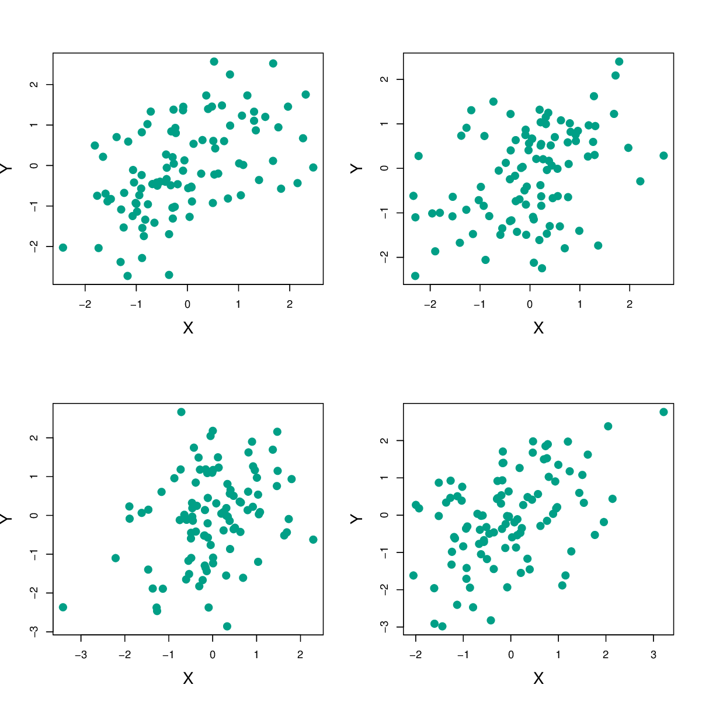
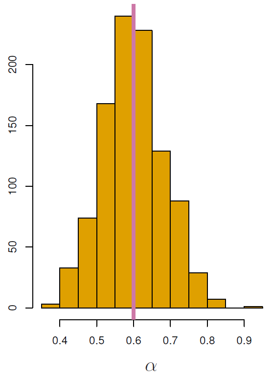
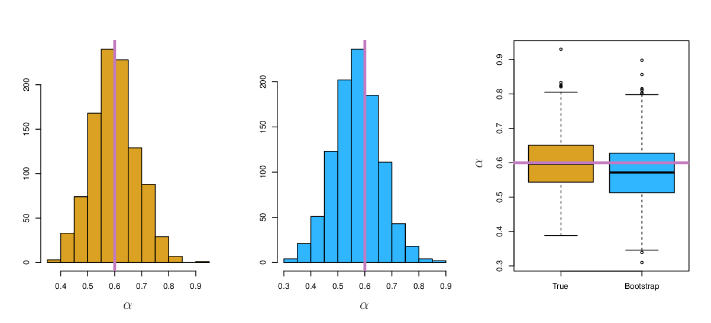

```{r setup, include=FALSE}
options(htmltools.dir.version = FALSE)
knitr::opts_chunk$set(
  eval = TRUE,
  message = FALSE,
  echo = TRUE,
  warnings = FALSE,
  fig.align = "center"
)

require(knitr)

```

# The bootstrap

Aim: Quantify uncertainty associated with a given estimator or statistical learning method

&rightarrow; Easy application to a wide range of methods

--

<br>
<br>

### Example

We wish to invest money in two financial assets

The two assets yield returns of $X$ and $Y$, $X$ and $Y$ are random quantities

---

# How do we determine $\alpha$?

$\alpha$ = fraction to be invested in $X$

Invest $\alpha$ in $X$, invest $\text{1 - }\alpha$ in $Y$

--

<br>

Problem: Variability associated with the returns of the two investments

&rightarrow; Choose $\alpha$ to minimize the total risk (=variance) of our investment which is given by $\text{Var(}\alpha X \text{ + (1 - }\alpha\text{)}Y)$

---

# How do we determine $\alpha$?

$\alpha$ that minimizes the risk:

$$\alpha = \frac{\sigma_Y^2 - \sigma_{XY}}{\sigma_X^2 + \sigma_Y^2 - 2\sigma_{XY}}$$

$\sigma_X^2\text{ = Var(}X\text{)}$

$\sigma_Y^2\text{ = Var(}Y\text{)}$

$\sigma_{XY}\text{ = Cov(}X\text{,}Y\text{)}$

---

# Simulation

At the time of investment: $\sigma_X^2$, $\sigma_Y^2$, and $\sigma_{XY}$ are unknown

But: We can estimate these variances using past measurements of $X$ and $Y$

--

<br>

$$\hat\alpha = \frac{\hat\sigma_Y^2 - \hat\sigma_{XY}}{\hat\sigma_X^2 + \hat\sigma_Y^2 - 2\hat\sigma_{XY}}$$

--

<br>

Therefore: Simulate 100 pairs of returns for investments $X$ and $Y$, four times

---

# Simulation

```{r, echo=F, out.width="480px"}

```

Four $\hat\alpha$ values range between 0.532 and 0.657

---

# Simulation

Simulate 100 pairs of returns for investments $X$ and $Y$, 1,000 times

$\sigma_X^2\text{ = 1}$

$\sigma_Y^2\text{ = 1.25}$

$\sigma_{XY}\text{ = 0.5}$

$\alpha\text{ = 0.6}$

Estimate $\alpha$ by substituting estimates of $\sigma_X^2$, $\sigma_Y^2$, and $\sigma_{XY}$ into formula

---

# Simulation

```{r, echo=F, out.width="380px"}

```

---

# Simulation

$$\bar\alpha = \frac{1}{1,000}\sum_{r=1}^{1,000} \hat\alpha_r = 0.5996$$

$$\sqrt{\frac{1}{1,000-1} \sum_{r=1}^{1,000}(\hat\alpha_r - \bar\alpha)^2} = 0.083$$
---

# The bootstrap

Problem: Simulated data, we cannot draw random samples from the **original population**

Solution: We draw $B$ random samples $Z^{*1}$, $Z^{*2}$, …, $Z^{*B}$ of $n$ observations from the **original data set** $Z$ with replacement

&rightarrow; $B$ distinct bootstrap data sets

&rightarrow; $B$ estimates for $\alpha$: $\hat\alpha^{*1}$, $\hat\alpha^{*2}$, …, $\hat\alpha^{*B}$

---

# The bootstrap

```{r, echo=F, out.width="700px"}
knitr::include_graphics("images/5.11.png")
```

---

# The bootstrap

$$SE_B(\hat\alpha) = \sqrt{\frac{1}{B-1} \sum_{r=1}^{B}\bigg(\hat\alpha^{*r} - \frac{1}{B} \sum_{r'=1}^{B} \hat\alpha^{*r'}\bigg)^2}$$
<br>
<br>

$SE_B(\hat\alpha)$ serves as an estimate of the standard error of $\hat\alpha$

&rightarrow; Simulation: 0.083

&rightarrow; Bootstrap: 0.087

---

# Comparison: Simulation vs. the bootstrap

```{r, echo=F, out.width="1100px"}

```


