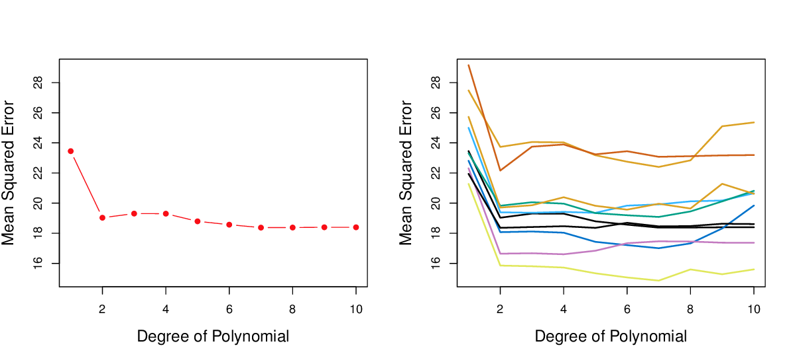
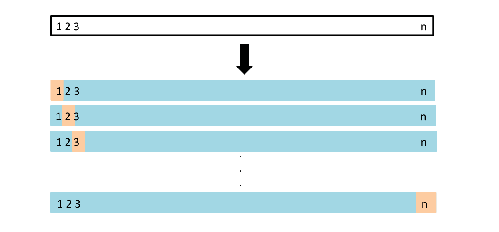
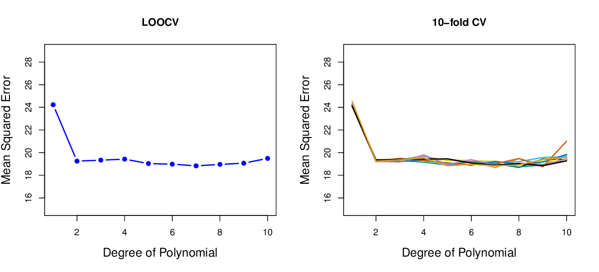
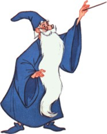
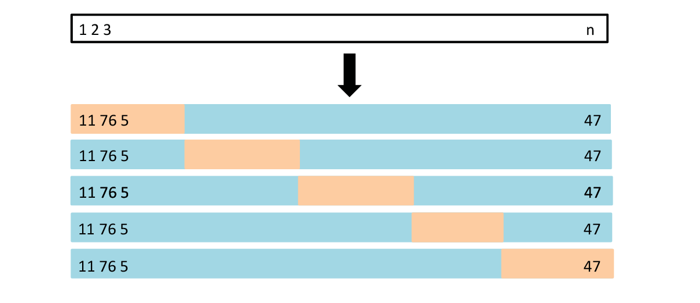
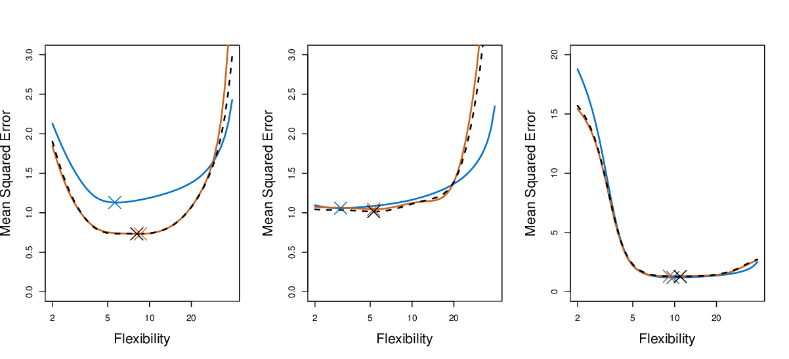
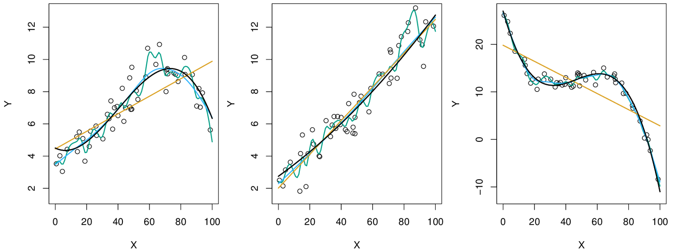
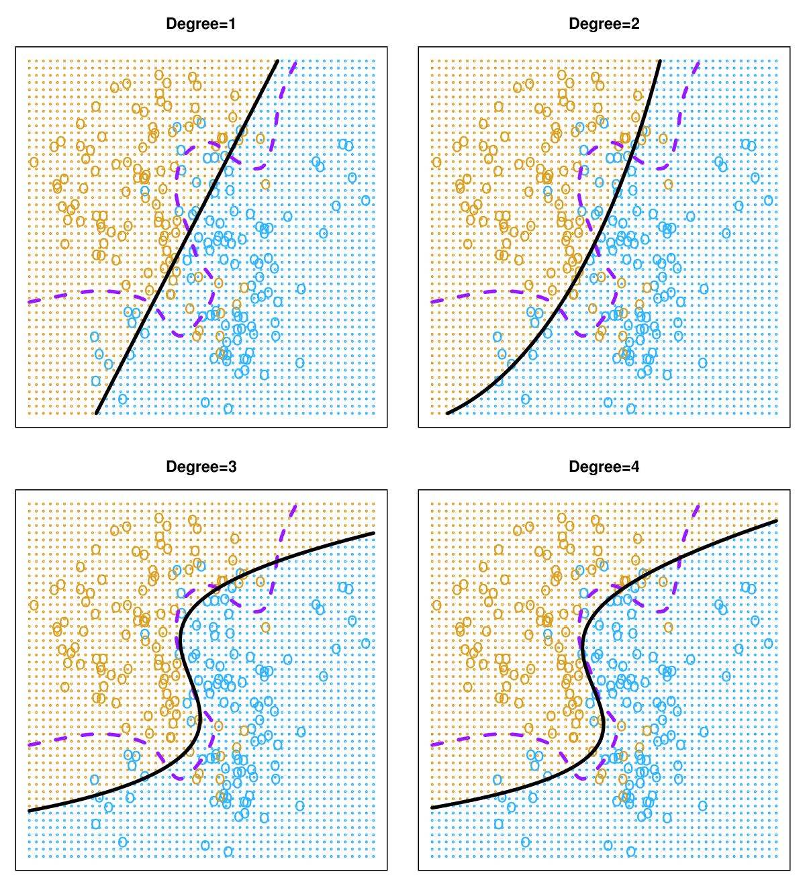
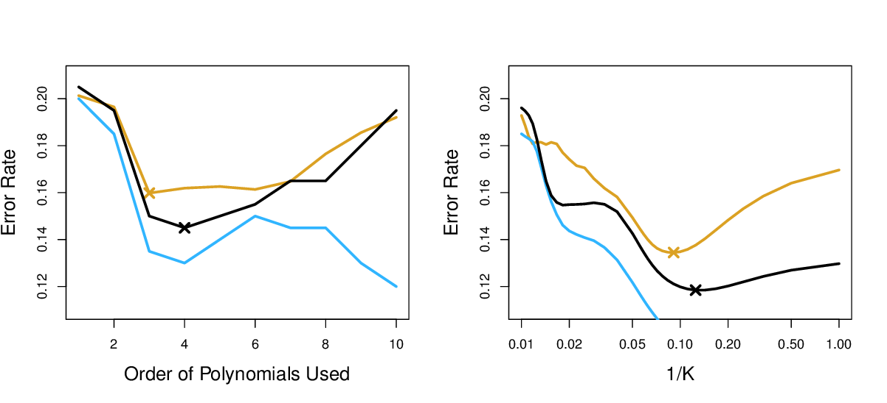

```{r setup, include=FALSE}
options(htmltools.dir.version = FALSE)
knitr::opts_chunk$set(
  eval = TRUE,
  message = FALSE,
  echo = TRUE,
  warnings = FALSE,
  fig.align = "center"
)

require(knitr)

colorize <- function(x, color) {
  if (knitr::is_latex_output()) {
    sprintf("\\textcolor{%s}{%s}", color, x)
  } else if (knitr::is_html_output()) {
    sprintf("<span style='color: %s;'>%s</span>", color, 
      x)
  } else x
}

```

# Resampling methods (RM)

“indispensable tool in modern statistics“

- model assessment: process of evaluating a model‘s performance

- model selection: process of selecting the proper level of flexibility

--

<br>
<br>
<br>

Two methods: 

1) Cross-Validation (CV)

2) Bootstrap

---

# Cross-Validation

test error

- average error that results from using statistical learning methods (SLM) to predict the response on a new observation

- needs designated test set 

--

<br>
<br>

training error

- estimate of the test error

- in the absence of a very large test set, test error can be estimated using available training data

---

# Cross-Validation

basic concept:

1) estimate the test error by holding out a subset of the training data from the fitting process

2) apply SLM to the held out observations

--

<br>
<br>
<br>

We will look at:

- Validation Set Approach

- Leave-One-Out CV (LOOCV)

- $k$-fold CV

---

# The Validation Set Approach - Concept

aim: estimate the test error associated with fitting a SLM on a set of 	observations

<br>
<br>
<br>
<br>

```{r, echo=F, out.width="800px"}
knitr::include_graphics("images/5.1.png")
```

---

# The Validation Set Approach - Example

dataset: `Auto` (392 observations)

- independent variable: `horsepower`

- dependent variable: `mpg`

<br>
<br>

--

Which regression model gives better results in predicting `mpg`?

- linear

- quadratic

- cubic

- higher-order

---

# The Validation Set Approach - Example

<br>
<br>

```{r, echo=F, out.width="800px"}

```

---

# The Validation Set Approach - Limitations

- validation estimate of the test error can be **highly variable**, depending on which observations are included in training set and validation set

- tends to **overestimate** the test error rate for the model fit on entire data

- CV addresses these limitations

---

# Leave-One-Out Cross-Validation - Concept

- LOOCV uses a single observation for validation set $\text{(}x_1\text{, }y_1\text{)}$

- remaining observations are used for the training set with $n-1$ observations $\text{\{(}x_2, y_2\text{),…, (}x_n, y_n\text{)\}}$

- prediction $\hat y_1$ is made using value $x_1$

- calculation of $MSE_1= (y_1 - \hat y_1)^2$

--

- repeat procedure by selecting $\text{(}x_2\text{, }y_2\text{)}$ for validation set, $\text{\{(}x_1, y_1\text{), (}x_3, y_3\text{),…, (}x_n, y_n\text{)\}}$ for training set, calculate $MSE_2= (y_2 - \hat y_2)^2$

- repeat procedure n times

--

<br>

**LOOCV estimate:**

$$CV_{(n)} = \frac{1}{n} \sum_{i=1}^{n}MSE_i$$

---

# Leave-One-Out Cross-Validation - Concept

<br>

```{r, echo=F, out.width="800px"}

```

---

# Leave-One-Out Cross-Validation - Advantages

- less bias using training sets of $n-1$

     &rightarrow; **less overestimation**

- performing LOOCV multiple times always yields the same results 

     &rightarrow; **no randomness** in the training/validation set splits

--

```{r, echo=F, out.width="600px"}

```

---

# Leave-One-Out Cross-Validation - Limitation

- LOOCV might be expensive to implement:

     - model has to be fit $n$ times
     
     - time consuming when $n$ is large and individual model is slow to fit

--

- magic formula:

.pull-left[
```{r, echo=F, out.width="200px"}

```
]

.pull-right[
$$CV_{(n)} = \frac{1}{n}\sum_{i=1}^{n}\bigg(\frac{y_i-\hat y_i}{1-h_i}\bigg)^2$$

with

$$h_i=\frac{1}{n} + \frac{(x_i-\bar x)^2}{\sum_{i'=1}^{n} (x_{i'} - \bar x)^2}$$

= leverage, defined in Chapter 3.37
]

---

# $k$-fold Cross Validation - Concept

- randomly dividing set of observations into $k$ groups of approximately equal size

- LOOCV is a special case of $k$-fold CV in which $k = n$

** $k$-fold CV estimate:**

$$CV_{(n)} = \frac{1}{n}\sum_{i=1}^{k}MSE_i$$

--

```{r, echo=F, out.width="600px"}

```

---

# Accuracy of Cross-Validation estimates

.center[
`r colorize('true test MSE', 'blue')`   `r colorize('LOOCV estimate', 'black')`   `r colorize('10-fold CV estimate', 'orange')`
]

```{r, echo=F, out.width="680px"}

```
```{r, echo=F, out.width="400px"}

```

---

# Bias-Variance Trade-Off for $k$-fold CV

bias

- validation set approach: **overestimation**

- LOOCV: **nearly unbiased** because each training set contains $n-1$ observations

- $k$-fold CV with $k = 5$ or $k = 10$: **intermediate level of bias**

<br>

--

variance

- LOOCV: $n$ fitted models, trained on almost identical sets of observations

     &rightarrow; outputs are highly correlated: **high variance**

- $k$-fold CV with $k < n$

     &rightarrow; less correlated since  overlap between training sets in each model is smaller: **less variance**

---

# Rule of thumb for $k$-fold CV

$k = 5$ or $k = 10$ has been empirically shown to yield test error rate estimates that suffer neither from

.pull-left[
- excessively high bias nor

- very high variance
]

.pull-right[
```{r, echo=F, out.width="400px"}

```
]

---

# Cross-Validation on Classification Problems

Quantify test error

- when $Y$ is quantiative: MSE

- When $Y$ is qualitative: number of missclassified observations
     
     - $k$-fold CV error rate and validation set error rates are defined analogously

     - e.g. for LOOCV:
     
$$CV_{(n)} = \frac{1}{n} \sum_{i=1}^{n}Err_i$$

with $Err_i = I(y_i ≠ \hat y_i)$

---

# Cross-Validation on Classification Problems

```{r, echo=F, out.width="450px"}

```

---

# Cross-Validation on Classification Problems

.center[
`r colorize('test error', 'orange')`   `r colorize('training error', 'blue')`   `r colorize('10-fold CV error', 'black')`
]

```{r, echo=F, out.width="800px"}

```

